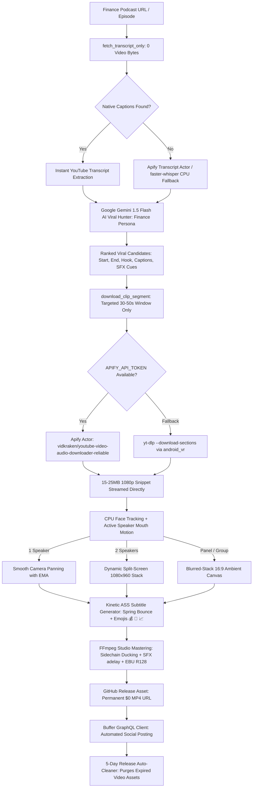

# Technical Architecture & Engineering Methodology

This document details the exact engineering methodology, algorithms, audio/video formulas, and architectural decisions behind the **Autonomous AI Podcast Viral Clipper & Buffer Social Media Publisher**.

---

## 1. End-to-End System Pipeline Flow



---

## 2. Ingestion & Targeted Segment Extraction Architecture

### The Problem with Full Video Downloads on Cloud Runners
Downloading 1-3 hour podcast videos (2GB–4GB) on CI runners wastes 10–20 minutes of runtime, risks runner disk saturation, and triggers YouTube datacenter IP bot gates (`Sign in to confirm you're not a bot`).

### The Solution: Transcript-First Evaluation + Targeted Snippet Download
1. **Zero-Byte Ingestion**: Transcripts and timestamps are retrieved *before any video bytes are downloaded*.
2. **AI Target Window Identification**: Gemini 1.5 Flash evaluates the transcript and determines exact timestamps (`startTime = 1007s`, `endTime = 1041s`).
3. **Apify Segment Actor**: `vidkraken/youtube-video-audio-downloader-reliable`
   - Executes across rotating residential proxies.
   - Extracts *only* the requested time window at 1080p.
   - Payload:
     ```json
     {
       "url": "https://www.youtube.com/watch?v=...",
       "startTime": 1007,
       "endTime": 1041,
       "format": "1080"
     }
     ```
   - Returns a direct MP4 URL for just the ~15–25MB snippet.
4. **Resilient Direct Resolution & Polling**:
   - Checks for immediate `downloadUrl` in synchronous dataset response.
   - Fault-tolerant polling with transient HTTP error recovery.
   - Fallback: Local `yt-dlp` using `--download-sections "*start-end"` via `android_vr` client.

---

## 3. Viral Moment Detection Methodology (Google Gemini 1.5 Flash)

### The 5 Viral Evaluation Vectors:
1. **0–5 Second Hook Score**: Opening statement must trigger curiosity, controversy, humor, or intense emotion to stop scrolling.
2. **Emotional Peak**: Debate, breakthrough revelation, vulnerability, or counter-intuitive insight.
3. **Standalone Coherence**: The clip must provide a complete, satisfying thought without requiring the preceding 2 hours of the podcast.
4. **Short-Form Platform Window**: Duration must strictly fall between **30 and 60 seconds** (the universal sweet spot for Shorts, Reels, and TikTok).
5. **SEO & Discovery Metadata**: Generates platform-tailored captions and trending hashtags.

---

## 4. Multi-Speaker Face Tracking & Framing Engine (`src/face_tracker.py`)

Podcasts typically feature single speakers, camera-switching close-ups, or two hosts sitting side-by-side in a wide 16:9 frame.

### Decision Matrix:
| Detected Faces | Layout Selected | Resolution | Action |
| :--- | :--- | :--- | :--- |
| **1 Face** | `single_smooth` | 1080x1920 | Tracks speaker's horizontal center with Exponential Moving Average (EMA). Glides naturally with movement; zero robotic jitter. |
| **2 Faces** | `split_screen` | 1080x1920 | Top pane (1080x960) centers Host; bottom pane (1080x960) centers Guest. Stacks them vertically with a clean partition bar. |
| **3+ Faces / 0 Faces** | `blur_stack` | 1080x1920 | Centers 16:9 footage (1080x608) over dynamic zoomed, blurred (`boxblur=25:5`), and darkened background. Zero cutoff. |

---

## 5. Broadcast Audio Mastering & Sound Design (`src/video_editor.py`)

Social media platforms re-compress uploaded audio. Improperly mastered audio results in distortion, muffled dialogue, or severe volume drops:

1. **High-Definition Vocal Chain**:
   - **80Hz High-Pass Filter (`highpass=f=80`)**: Cuts inaudible sub-bass desk rumble and HVAC hum.
   - **Vocal Presence EQ (`equalizer=f=3000:width_type=h:width=1000:g=2.5`)**: Adds +2.5 dB speech intelligibility.
   - **Air Lift (`equalizer=f=10000:width_type=h:width=2500:g=1.8`)**: Studio brilliance and sheen.

2. **Dynamic Audio Sidechain Ducking (`sidechaincompress`)**:
   - Voice audio is split (`asplit=2[voice][voice_sc]`).
   - The auxiliary control signal triggers automatic volume reduction on background music whenever the speaker talks:
     ```
     [1:a]aformat=channel_layouts=stereo,volume=-15dB[bgm_pre];
     [bgm_pre][voice_sc]sidechaincompress=threshold=0.07:ratio=6:attack=30:release=350[bgm_duck]
     ```
   - Eliminates competing frequencies and maintains crisp voice dominance.

3. **Synchronized SFX Sound Design (`adelay`)**:
   - Sound effects (`whoosh.wav`, `pop.wav`, `ding.wav`) are positioned with millisecond accuracy:
     ```
     [N:a]aformat=channel_layouts=stereo,adelay=1200|1200,volume=-3dB[sfx_0]
     ```
   - Stream inputs are mixed using `amix=inputs=K:duration=first:dropout_transition=2`.

4. **EBU R128 Loudness Normalization (`loudnorm=I=-14:TP=-1.5:LRA=11`)**:
   - **Target Integrated Loudness**: `-14.0 LUFS` (standard specification for YouTube Shorts, Instagram Reels, and TikTok).
   - **True Peak**: `-1.5 dBTP` (prevents lossy AAC compression clipping distortion).

---

## 6. Social Media Safe-Zone & Subtitle Engineering (`src/subtitle_generator.py`)

### Platform UI Overlay Zones:
- **Top 240px (12.5%)**: Reserved for search bars, audio icons, and platform headers.
- **Bottom 380px (19.8%)**: Reserved for creator handle, audio description, captions, and sound discs.
- **Right 120px (11.1%)**: Reserved for Like, Comment, Bookmark, and Share button column.

### Subtitle Safe Placement:
- **Bottom Margin**: Layout-specific margins keep text above platform controls; the implementation uses different values for solo, blur-stack, and split-screen layouts.
- **Split-Screen Mode**: Anchors text along the middle divider to preserve faces in both panes.

### Studio Kinetic Subtitles:
- **Kinetic Bounce Scaling**: Spoken words pop with high-energy spring animation:
  `{\c<highlight>\t(0,70,\fscx118\fscy118)\t(70,140,\fscx100\fscy100)}WORD`
- **Text Safety**: Transcript text is normalized to a font-safe character set; emoji glyphs are not burned into the ASS output.
- **Top Hook Retention Capsule**: An upper-safe-zone capsule badge reinforces the central question/hook during the critical first 3 seconds.
- Themes:
  - `hormozi`: Crisp White (`#FFFFFF`) + Electric Yellow (`#FFE600`) + 4px black outline.
  - `neon_green`: Bright White + Toxic Neon Green (`#00FF66`).
  - `luxury_gold`: Ivory White + Warm Metallic Gold (`#FFD700`).
  - `cyber_cyan`: Pure White + Electric Cyan (`#00F0FF`).

---

## 7. Storage Lifecycle & Auto-Cleanup (`src/release_cleaner.py`)

1. **GitHub Releases Storage Model**:
   - Assets are hosted on Azure Blob / S3 behind `uploads.github.com`.
   - Max single asset size: **2 GB**.
   - Do not bloat repository Git commit history.
2. **Auto-Cleanup Routine**:
   - Once Buffer fetches the video URL, retaining raw multi-gigabyte MP4 releases forever is unnecessary.
   - Every run evaluates: `(now - release.created_at).days >= 5`.
   - Purges expired releases and tags, keeping storage permanently minimal.
