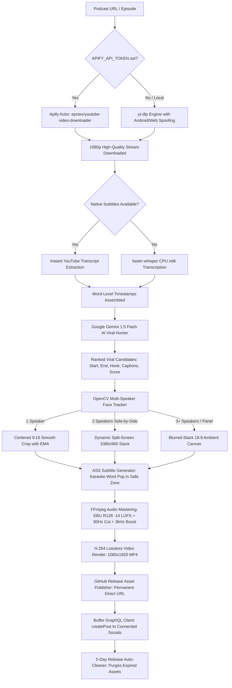

# Technical Architecture & Engineering Methodology

This document details the exact engineering methodology, algorithms, audio/video formulas, and architectural decisions behind the **Autonomous AI Podcast Viral Clipper & Buffer Social Media Publisher**.

---

## 1. End-to-End System Pipeline Flow



---

## 2. Ingestion & Bot-Bypass Architecture

### The Problem with Cloud Datacenter IPs
GitHub Actions runners operate within Microsoft Azure IP ranges. YouTube blocks datacenter IP subnets with aggressive `Sign in to confirm you're not a bot` captchas.

### The Solution: Apify Proxy Actor Integration
1. **Actor Choice**: `epctex/youtube-video-downloader`
   - Executes across residential/datacenter rotated proxies.
   - Extracts 1080p video streams directly to Apify's Key-Value Store.
2. **Polling Loop Architecture**:
   ```python
   # Trigger actor asynchronously
   res = requests.post("https://api.apify.com/v2/acts/epctex~youtube-video-downloader/runs", json=payload)
   run_id = res.json()["data"]["id"]
   # Poll until finished
   while True:
       status = requests.get(f".../actor-runs/{run_id}").json()["data"]["status"]
       if status == "SUCCEEDED": break
       time.sleep(4)
   ```
3. **Authenticated Streaming**:
   Direct records from Apify require `Authorization: Bearer <APIFY_KEY>`. The downloader streams chunks (1MB buffer) directly to `downloads/<videoId>.mp4`.

---

## 3. Viral Moment Detection Methodology (Google Gemini 1.5 Flash)

### The 5 Viral Evaluation Vectors:
1. **0–5 Second Hook Score**: Opening statement must trigger curiosity, controversy, humor, or intense emotion to stop scrolling.
2. **Emotional Peak**: Debate, breakthrough revelation, vulnerability, or counter-intuitive insight.
3. **Standalone Coherence**: The clip must provide a complete, satisfying thought without requiring the preceding 2 hours of the podcast.
4. **Short-Form Platform Window**: Duration must strictly fall between **30 and 60 seconds** (the universal sweet spot for Shorts, Reels, and TikTok).
5. **SEO & Discovery Metadata**: Generates platform-tailored captions and trending hashtags.

---

## 4. Multi-Speaker Face Tracking & Framing Engine (`src/face_tracker.py`)

Podcasts typically feature single speakers, camera-switching close-ups, or two hosts sitting side-by-side in a wide 16:9 frame.

### Decision Matrix:
| Detected Faces | Layout Selected | Resolution | Action |
| :--- | :--- | :--- | :--- |
| **1 Face** | `single_smooth` | 1080x1920 | Tracks speaker's horizontal center with Exponential Moving Average (EMA). Glides naturally with movement; zero robotic jitter. |
| **2 Faces** | `split_screen` | 1080x1920 | Top pane (1080x960) centers Host; bottom pane (1080x960) centers Guest. Stacks them vertically with a clean partition bar. |
| **3+ Faces / 0 Faces** | `blur_stack` | 1080x1920 | Centers 16:9 footage (1080x608) over dynamic zoomed, blurred (`boxblur=25:5`), and darkened background. Zero cutoff. |

---

## 5. Broadcast Audio Mastering Formulas (`src/video_editor.py`)

Social media platforms re-compress uploaded audio. Improperly mastered audio results in distortion, muffled dialogue, or severe volume drops:

1. **80Hz High-Pass Filter (`highpass=f=80`)**:
   - Cuts inaudible sub-bass desk rumble, HVAC hum, and mic boom vibrations.
2. **Vocal Presence EQ (`equalizer=f=3000:width_type=h:width=1000:g=2.5`)**:
   - Adds +2.5 dB gain around 3.0 kHz, the speech intelligibility spectrum. Voices cut crisply through phone speakers.
3. **EBU R128 Loudness Normalization (`loudnorm=I=-14:TP=-1.5:LRA=11`)**:
   - **Target Integrated Loudness**: `-14.0 LUFS` (standard specification for YouTube Shorts, Instagram Reels, and TikTok).
   - **True Peak**: `-1.5 dBTP` (prevents lossy AAC compression clipping distortion).

---

## 6. Social Media Safe-Zone & Subtitle Engineering (`src/subtitle_generator.py`)

### Platform UI Overlay Zones:
- **Top 240px (12.5%)**: Reserved for search bars, audio icons, and platform headers.
- **Bottom 380px (19.8%)**: Reserved for creator handle, audio description, captions, and sound discs.
- **Right 120px (11.1%)**: Reserved for Like, Comment, Bookmark, and Share button column.

### Subtitle Safe Placement:
- **Bottom Margin**: `MarginV = 420` (anchors text in the lower-middle safe zone, clearing all platform UI buttons).
- **Split-Screen Mode**: Anchors text along the middle divider (`Alignment = 5`, Center) to preserve faces in both panes.

### Studio Aesthetic Themes:
- **Pacing**: Short phrases of **2 to 4 words** maximum for high viewer retention.
- **Karaoke Active Word Pop**:
  `{\c<highlight_color>\t(\fscx108\fscy108)}WORD{\c<primary_color>\fscx100\fscy100}`
- Themes:
  - `hormozi`: Crisp White (`#FFFFFF`) + Electric Yellow (`#FFE600`) + 4px black outline.
  - `neon_green`: Bright White + Toxic Neon Green (`#00FF66`).
  - `luxury_gold`: Ivory White + Warm Metallic Gold (`#FFD700`).
  - `cyber_cyan`: Pure White + Electric Cyan (`#00F0FF`).

---

## 7. Storage Lifecycle & Auto-Cleanup (`src/release_cleaner.py`)

1. **GitHub Releases Storage Model**:
   - Assets are hosted on Azure Blob / S3 behind `uploads.github.com`.
   - Max single asset size: **2 GB**.
   - Do not bloat repository Git commit history.
2. **Auto-Cleanup Routine**:
   - Once Buffer fetches the video URL, retaining raw multi-gigabyte MP4 releases forever is unnecessary.
   - Every run evaluates: `(now - release.created_at).days >= 5`.
   - Purges expired releases and tags, keeping storage permanently minimal.
